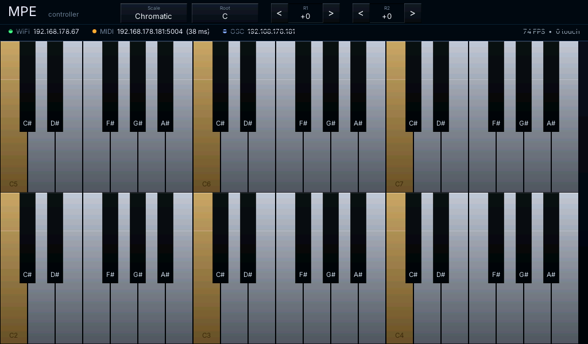

# esp32-p4-dsi-mpe-controller

A real-time **multitouch MPE controller** running on the
[Waveshare ESP32-P4-Nano](https://www.waveshare.com/wiki/ESP32-P4-Nano)
+ EK79007 7" 1024×600 MIPI-DSI panel + GT911 5-point capacitive touch.

Plays a **dual-row piano keyboard** with full per-finger expression
(velocity / glide / slide / press / lift) and streams it to a host
over WiFi as both **RTP-MIDI** (a.k.a. AppleMIDI / network MIDI) and
**OSC 1.0**.



The image above is a live screenshot of the firmware running on real
hardware, captured from `/screenshot.bmp` (see *Grabbing a
screenshot* below).

## Why

I wanted a self-contained, tactile MPE-capable instrument that
plugged into the existing MIDI 2.0 / network-MIDI ecosystem without
any specialised hardware on the host. A 1024×600 panel is enough
real estate for two playable octaves per row, and the ESP32-P4 is the
first low-cost MCU that has the I/O bandwidth (MIPI-DSI + PSRAM +
WiFi-via-C6 SDIO) to drive that panel _and_ run a 60-FPS animated UI
_and_ stream MPE/OSC over UDP without dropping frames.

The project is also a working reference for a few non-trivial
ESP32-P4 patterns:

- direct framebuffer rendering at 60 FPS with double-buffered
  scan-out + PPA-accelerated partial restore
- a decoupled real-time touch task (250 Hz) so MPE timing isn't tied
  to the renderer
- an RTP-MIDI session client (initiation, clock sync, MIDI payload)
  written from scratch (~400 lines)
- a custom Espressif PPA-fill / SRM integration with explicit
  PSRAM cache flushes

## Features

### Instrument

- **Dual-row keyboard.** 3 octaves per row, real piano proportions
  (white + black keys with the standard 7+5 layout). Top row treble,
  bottom row bass.
- **MPE 5-finger polyphony.** Each finger gets its own MIDI member
  channel (1..5), master channel 0. Configurable PB range, defaults
  to ±48 semitones.
- **Snap to pitch on NoteOn.** Pitch-bend starts centred (0x2000)
  the moment you touch; only the _slide_ from that anchor bends the
  pitch — 1 white-key of slide = 1 semitone.
- **Soft-then-exponential velocity curve.** GT911 contact area is
  mapped through `(strength/90)^1.7 × 127` so light touches sit low
  in the CC range and firm playing accelerates into the upper
  register naturally.
- **Per-touch expression**:
  - STRIKE  → NoteOn velocity from contact area
  - GLIDE   → per-channel **Pitch Bend** from Δx since anchor
  - SLIDE   → per-channel **CC74** (timbre) from absolute screen-Y
              (continuous across rows)
  - PRESS   → per-channel **Channel Pressure** from ongoing
              contact area
  - LIFT    → NoteOff

#### Expression wiring on the host

The firmware sends the canonical MPE expression set, in the
recommended strict order on every NoteOn: PB-centre → CC74 → Z=0 →
NoteOn. On every transition from disconnected→connected the host
also receives the **MPE-Config RPN** (Zone RPN 6) on the master
channel + a per-member-channel **Pitch-Bend Range RPN** (RPN 0)
matching `MPE_MIDI_PB_RANGE_SEMITONES`.

So in your synth, **per-note** expression arrives as:

| Dimension       | MIDI message                       | Typical default mapping       |
| --------------- | ---------------------------------- | ----------------------------- |
| Glide (X)       | Pitch Bend on the member channel   | Pitch                         |
| Slide (Y/timbre)| **CC74** on the member channel     | Filter cutoff / "timbre" macro|
| Press (Z)       | Channel Pressure on the member ch. | Filter env / volume / vibrato |

Most MPE-aware synths (Surge XT, Diva, Pigments, Equator, Falcon)
auto-map these to filter cutoff (CC74) and amp / filter envelope
(Z) without any extra setup once they see the MPE-Config RPN. If
your synth ignores CC74, check that it's running in *MPE mode* and
not single-channel-poly, and that "expression" / "timbre" routing
is enabled in its mod matrix.
- **On-screen controls.** Cycle scale (Chromatic / Major / Minor /
  Pentatonic / Dorian / Blues), cycle root note, shift each row by
  ±3 octaves — all by tapping chips in the top bar.

### Networking

- **RTP-MIDI / AppleMIDI session** to a configurable host:port.
  Compatible with macOS Audio MIDI Setup *Network Session*, Windows
  *rtpMIDI* driver, and Linux *rtpmidid*. The session client owns
  invitation, clock sync (CK0/1/2 round-trip), and packet
  sequencing; latency to a wired LAN host is typically ≤15 ms.
- **OSC 1.0 over UDP** to a separate configurable host:port,
  bundled at the configured rate (default 200 Hz). Each touch
  emits `/mpe/touch ,iiiffffff` with slot, channel, MIDI note,
  x/y normalised, pitch-bend, pressure, and per-row coordinates.

### Rendering

- 60 FPS double-buffered with vsync sync.
- Pre-baked static template; per-frame dirty-rect partial restore
  via the ESP32-P4's PPA (Pixel Processing Accelerator) for the
  rectangle copies, CPU for the alpha-blended dynamic overlays
  (finger glow, activity halo, status text, per-finger floating
  note label).
- TrueType text rendering via `stb_truetype` with a 512-glyph LRU
  cache in PSRAM. Ships with Inter Variable; replace
  `main/font.ttf` with any other TTF to taste.
- Custom RGB565 paint primitives: gradient fill, alpha rect, soft
  circle, quadratic-falloff additive glow with incremental Δ-d²
  inner loop (no per-pixel multiplies, no per-pixel divides).

## Hardware

| Part                                | Notes                                   |
| ----------------------------------- | --------------------------------------- |
| Waveshare ESP32-P4-Nano             | 16 MB flash, 32 MB octal PSRAM @ 200 MHz |
| EK79007AD 7" 1024×600 MIPI-DSI panel | Ships with the Espressif EV-Board kit   |
| GT911 5-point capacitive touch      | On-panel, I²C carried by the DSI FFC    |
| ESP32-C6 (on-board, SDIO)           | WiFi + BLE via `esp_hosted`             |

Wiring is the Waveshare/Espressif EV-Board reference; see the
`Display` menu in `idf.py menuconfig` for GPIO assignments.

## Build & flash

```sh
. $IDF_PATH/export.sh
idf.py set-target esp32p4
idf.py menuconfig         # fill in WiFi SSID/password + MIDI/OSC peer IPs
idf.py build
idf.py -p /dev/cu.usbmodem* flash monitor
```

Tested on **ESP-IDF v6.0**.

### Configuration

Everything is in `idf.py menuconfig` → *esp32-p4-nano-mpempe*:

- **WiFi** — SSID, password.
- **MIDI** — RTP-MIDI peer host + port, session name, default
  pitch-bend range.
- **OSC** — UDP peer host + port, bundle rate.
- **Instrument** — rows, octaves per row, lowest octave (bottom
  row), row octave offset, initial-velocity override.

## Host-side setup

### macOS — Network MIDI

1. Open **Audio MIDI Setup**.
2. *Window → Show MIDI Studio → Network*.
3. Under *My Sessions*, click **+** and enable the session.
4. Set *Who may connect to me* → **Anyone**.
5. Flash the firmware with macOS's IP as `MPE_MIDI_HOST`. The
   device will appear under *Directory* and connect automatically.
6. Route the session's MIDI to your DAW's input.

### Windows — rtpMIDI

Install [Tobias Erichsen's rtpMIDI driver](https://www.tobias-erichsen.de/software/rtpmidi.html),
create a session, and add the device's IP as an allowed peer.

### Linux — rtpmidid

```sh
sudo apt install rtpmidid
sudo systemctl start rtpmidid
```

Then in your DAW / sampler, select the `Network` ALSA / JACK MIDI
device.

### OSC — anything

Point the device at your machine's IP/port (e.g. SuperCollider,
TouchDesigner, Pure Data, Max). The `/mpe/touch` schema is
documented above; `/mpe/clear` fires when all fingers lift.

## Grabbing a screenshot

The firmware exposes a tiny HTTP server on port 80:

- `http://<device-ip>/`             — minimal HTML viewer
- `http://<device-ip>/screenshot.bmp` — live front-buffer as BMP

```sh
docs/grab_screenshot.sh <device-ip>
# writes docs/screenshot.png (~20 KB, PNG-encoded from the BMP)
```

The endpoint always returns the buffer the panel is currently
scanning out, so what `curl` saves is what's on the display at that
instant.

## Performance

| Scenario                              | FPS    |
| ------------------------------------- | ------ |
| Idle (no touches)                     | 60-76  |
| 1-2 fingers + active trails           | 45-60  |
| 5 fingers + sustained motion          | 30-45  |

Touch dispatch is decoupled from the renderer in its own task at
250 Hz, so MIDI / OSC events fire at full GT911 sample resolution
regardless of frame rate.

## Project layout

```
main/
  main.cpp           — orchestrator, render loop, template bake,
                       touch task, dirty-rect partial restore
  controller.cpp     — touch → MPE/OSC dispatch, scale/root state,
                       keyboard model + hit-test, velocity LUT
  ui.cpp             — dynamic per-frame overlays
  font.ttf           — Inter Variable, OFL 1.1 (swap for any TTF)
components/
  mpe-display        — EK79007 DSI bring-up, double-buffer present,
                       PPA-accelerated rect copy, BL/I2C
  mpe-touch          — GT911 5-point read with latch-against-gaps
  mpe-paint          — RGB565 primitives (gradient, alpha rect,
                       soft circle, additive glow)
  mpe-font           — stb_truetype + LRU glyph cache
  mpe-wifi           — esp_hosted STA, blocking init
  mpe-osc            — OSC 1.0 builder + UDP sender
  mpe-applemidi      — RTP-MIDI session client (IN/OK/CK/MIDI)
  mpe-screenshot     — /screenshot.bmp HTTP endpoint
docs/
  screenshot.png     — README hero image
  grab_screenshot.sh — refresh via curl
```

## Status

Functional. Known polish items:

- The PPA `M2C` cache invalidate path on the back buffer logs
  alignment warnings on rect restores; the rendering still works
  but the per-rect invalidate is effectively a no-op. Cache effects
  remain small because the framebuffer is many times the L1 size
  and gets naturally evicted between presents — but a tidy fix is
  to align the invalidate range to cache-line boundaries.
- AppleMIDI re-connect after the host puts its session to sleep is
  manual: tap the *Connect* button in macOS Audio MIDI Setup.

## License

The application code (`main/`, `components/mpe-*`) is MIT.

Vendored third-party:

- `deps/stb_truetype.h` — public domain (stb)
- `main/font.ttf` — Inter Variable, [SIL Open Font License 1.1](https://github.com/rsms/inter/blob/master/LICENSE.txt)

Managed components pulled by `idf.py` are subject to their own
licenses (Espressif, Apache-2.0).
